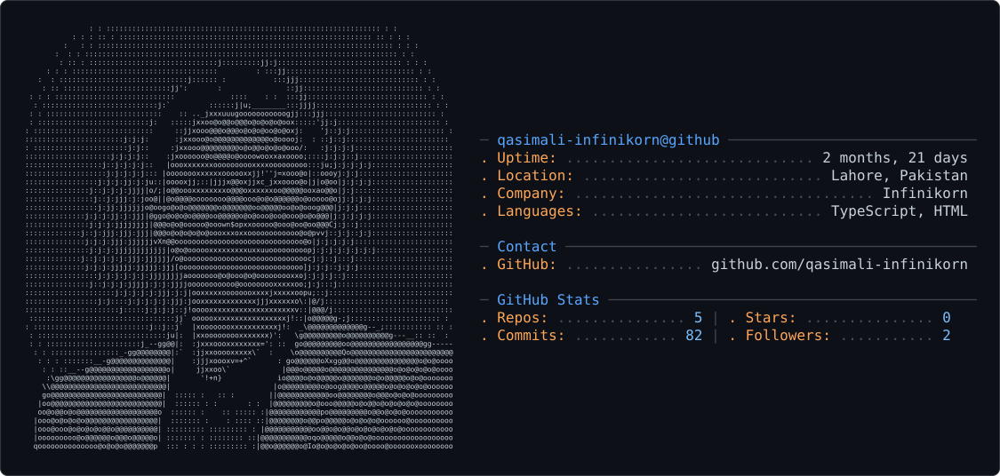
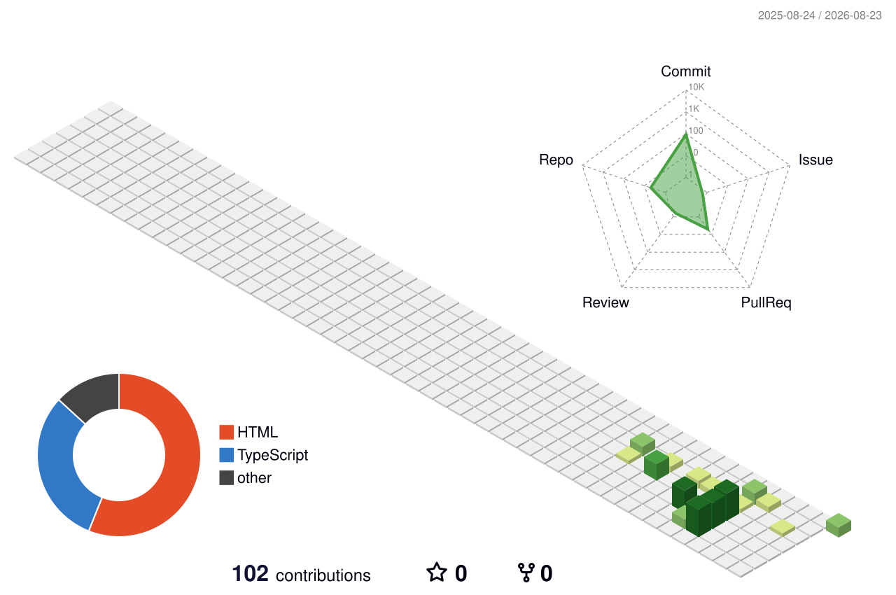

<picture>
  <source media="(prefers-color-scheme: dark)" srcset="dark_mode.svg" />
  <source media="(prefers-color-scheme: light)" srcset="light_mode.svg" />
  
</picture>

# Hi, I'm Qasim Ali 👋

  

### Senior Full-Stack Engineer | Rails, React, Next.js | AI Integrations | SaaS Architect

I build scalable SaaS products, AI-powered applications, and modern web platforms from concept to production.

With expertise across backend architecture, frontend development, cloud infrastructure, and AI integrations, I enjoy transforming complex business problems into intuitive digital experiences.

---

## 🚀 Current Focus 

* Building AI-powered applications and workflows
* Developing scalable SaaS platforms
* Creating interactive learning and engagement experiences
* Architecting modern Rails & Next.js applications
* Exploring AI Agents and LLM integrations

---

## 💼 Featured Projects

### 🚀 TeleSesh Spark

An AI-powered learning and engagement platform focused on creating interactive experiences for children, therapists, educators, and facilitators.

**Highlights**

* AI Resource Studio
* Interactive Games Generator
* Real-time Collaboration
* Session Management
* Next.js + Rails Architecture

---

### 🤖 AI Resource Studio

A conversational AI platform that generates:

* Interactive Games
* Worksheets
* Quizzes
* PPT Presentations
* PDF Workbooks
* DOCX Handouts

using natural language prompts.

---

### ⚡ SaaS Automation Platforms

Designed and developed scalable business applications focused on:

* Workflow Automation
* CRM Solutions
* Customer Portals
* Subscription Management
* AI Integrations

---

## 🛠 Tech Stack

  

### Backend

  

### Frontend

  

### Cloud & DevOps

  

### AI & Tools

  

* OpenAI
* Claude
* LangChain
* AI Agents
* Prompt Engineering

---

## 📊 GitHub Stats

  
  

  

  

---

## 🎯 What I Enjoy Building

* SaaS Products
* AI-Powered Applications
* Learning Platforms
* Business Automation Systems
* Developer Tools
* Interactive Experiences

---

## 🌱 Currently Learning 

* AI Agents & Multi-Agent Systems
* Advanced LLM Architectures
* RAG Systems
* Workflow Automation
* Modern Product Engineering

---

## 🤝 Let's Connect 

I'm always interested in discussing:

* Product Development
* SaaS Architecture
* AI Integrations
* Startup Ideas
* Engineering Leadership

📧 [qasim.ali@infinikorn.com](mailto:qasim.ali@infinikorn.com)
* GitHub: https://github.com/qasimali-infinikorn
* Email: [qasim.ali@infinikorn.com](mailto:qasim.ali@infinikorn.com)

---

> “Great software is not just about code—it's about creating experiences that solve real problems.”

---

### Thanks for visiting my profile! 🚀
